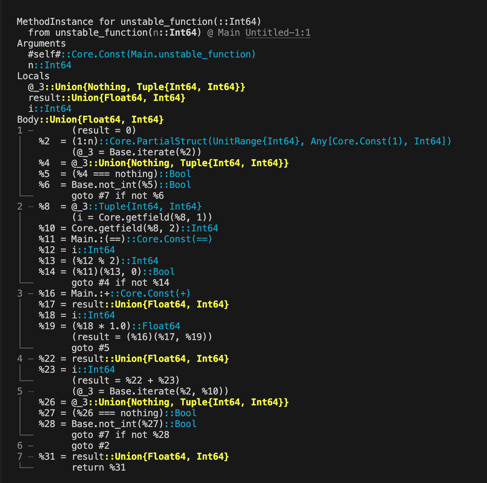
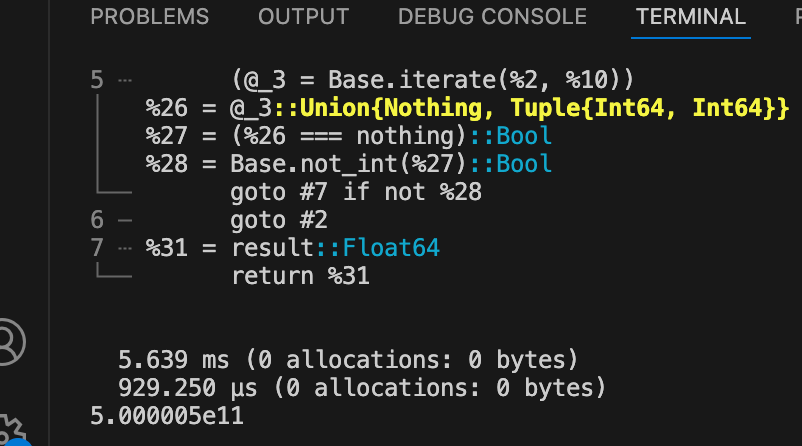
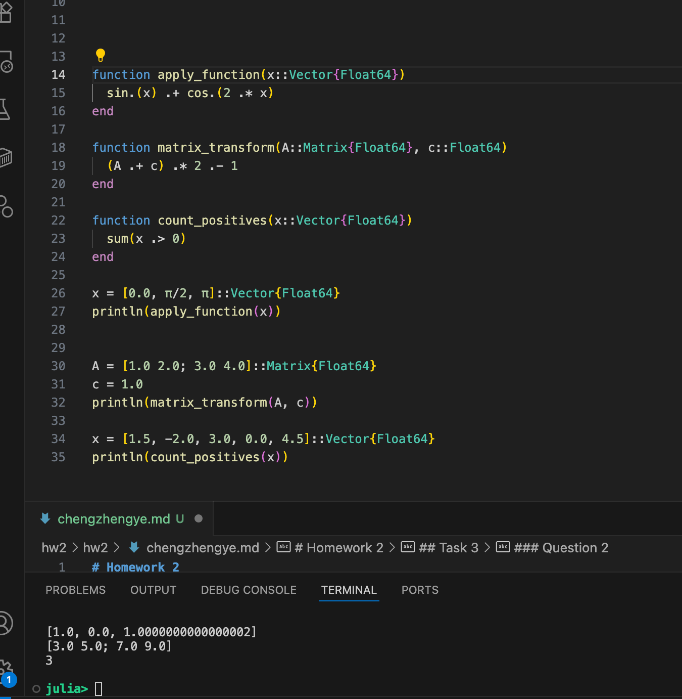

# Homework 2

## Task 1

### Question 1

first_element = A[1]        # Get first element
last_element = A[end]         # Get last element  
first_three = A[1:3]          # Get first three elements
reverse_order = A[end:-1:1]        # Get all elements in reverse order
every_second = A[1:2:end]         # Get every second element (10, 30, 50)

1. The index of first element is 1.
2. A[2:4]
3. A[end]

### Question 2
1. They both will be Float64.
2. it shows MethodError:
       no method matching mystery_function(::Int64, ::Int64)
3. I will define : function mystery_function(x::Number, y::Number)

## Task 2

### Question 1
    when i set x = randn(1000), the benchmark time shows  
      2.708 ns (0 allocations: 0 bytes)
      2.708 ns (0 allocations: 0 bytes)
      2.708 ns (0 allocations: 0 bytes)
    and cant tell the difference. So i set x = randon(1000000)
      the result shows
      2.750 ns (0 allocations: 0 bytes)
      2.750 ns (0 allocations: 0 bytes)
      2.708 ns (0 allocations: 0 bytes)

    The broadcasting is faster.
    Julia's broadcasting mechanism achieves higher performance by optimizing memory access and reducing data duplication. It operates directly on elements of the original array without creating new arrays or copying data, thereby cutting down on memory allocation, deallocation, and copy overhead—especially effective for large datasets.

### question 2

1. 
2. I will modify the 'result = 0' to 'result = 0.0'. Define it as Float64
3. The unstable version takes 5.639ms
   The stabel version takes 929.25μs
   

## Task 3

### Question 1
    zeros_array = zeros(3, 3)
    ones_vector = ones(5) 
    random_matrix = rand(2, 4)
    range_vector = 1:5   

    element_22 = A[2, 2]   
    second_row = A[2, :] 
    first_column = A[:, 1] 
    main_diagonal = diag(A) 

### Question 2
  1. function apply_function(x::Vector{Float64})
        sin.(x) .+ cos.(2 .* x) 
      end

    function matrix_transform(A::Matrix{Float64}, c::Float64)
      (A .+ c) .* 2 .- 1
    end

    function count_positives(x::Vector{Float64})
      sum(x .> 0)
    end
  2. 
  3. The dot operator (.) in broadcasting applies functions or operators to each element of an array without explicit loops.