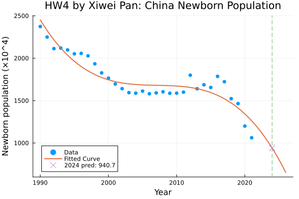
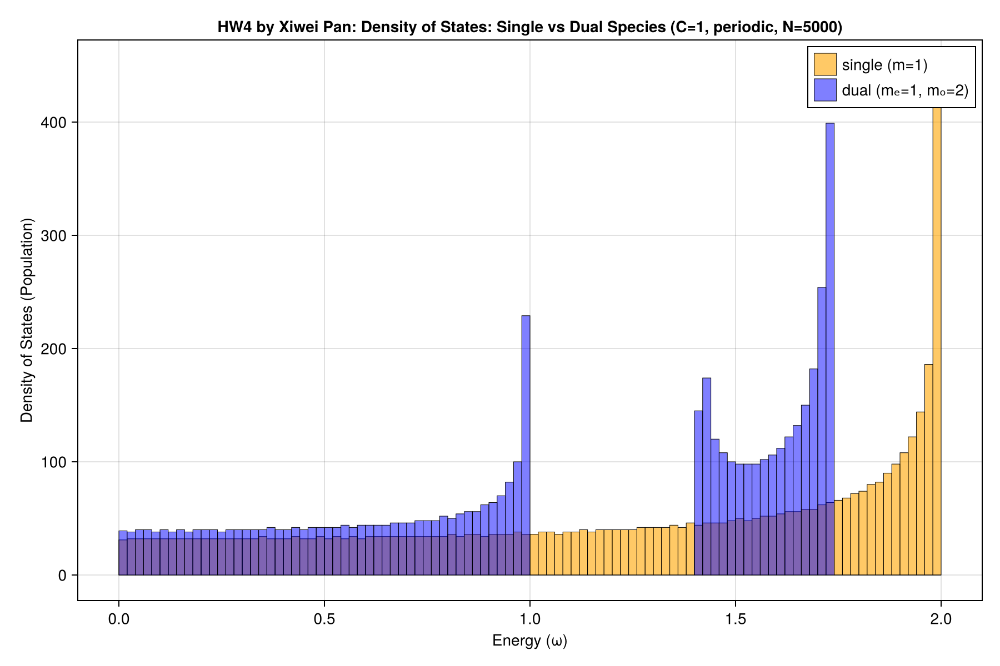

# Homework 4


1. **(Condition Number Analysis)** 

Answer: (a) ill-conditioned, (b) well-conditioned, (c) well-conditioned, (d) ill-conditioned

```julia
A = [10^10 0; 0 10^-10]
B = [10^10 0; 0 10^10]
C = [10^-10 0; 0 10^-10]
D = [1 2; 2 4]
```

```julia
cond(A) # 1.0e20
cond(B) # 1.0
cond(C) # 1.0
cond(D) # 4.804857307547117e16
```

2. **(Solving Linear Equations)** 

Answer:

```julia
A = [2 1 -1 0 1; 1 3 1 -1 0; 0 1 4 1 -1; -1 0 1 3 1; 1 -1 0 1 2]
b = [4, 6, 2, 5, 3]
x = A \ b

5-element Vector{Float64}:
 -0.04651162790697683
  2.186046511627907
  0.30232558139534904
  0.8139534883720929
  2.2093023255813957
```

3. **(Polynomial Data Fitting)** 

   Answer:

   - Fitted curve coefficients: `a = [2451.5802139037405, -131.88430413372686, 7.607889485048699, -0.1481152805949957]` if $y = a_0 + a_1 x + a_2 x^2 + a_3 x^3$, $x = \mathrm{year} - 1990$.
   - Predicted newborn population for 2024: about `940.7 × 10^4` people.
   - Plot: 

4. **(Extra points: Eigen-decomposition)** Solve the following problem:

    Consider a dual species spring chain, with the number of sites as large as possible. The mass is 1 on even sites and 2 on odd sites, and stiffness constant is $C = 1$. The boundary condition is periodic.
    - Show the density of states at different energy with binned bar plot. The $x$-axis is the energy, the $y$-axis is the population.
    - Compare with the result of the single species spring chain.

    Ref: the `hist` function in CairoMakie: https://docs.makie.org/dev/reference/plots/hist

    Answer: 
    

    Mainly modified function:
    ```julia
    function eigenmodes(e::EigenSystem{T}) where T
      Ksym = Symmetric(e.K)
      Mdiag = Diagonal(e.ms)
      vals, vecs = eigen(Ksym, Mdiag)
      λ = max.(zero(T), real(vals))
      frequency = sqrt.(λ)
      return EigenModes(frequency, vecs)
   end
    ```