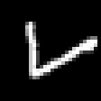
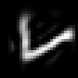
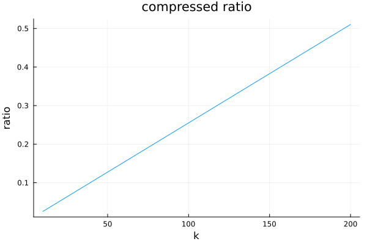
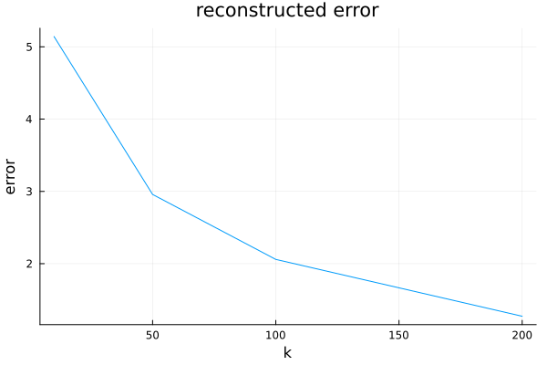
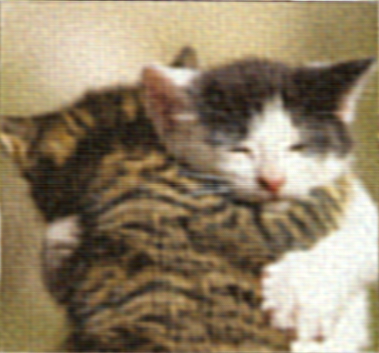

# Homework 5
1. 
I use the following code to compress the image and calculate the compressed ratio, reconstruction error
```julia
include("../download_mnist.jl")
using LinearAlgebra
using Images, ImageView
using Plots
test_images, test_labels = download_mnist(:test)
println("Test set: ", size(test_images))  
flattened_image = reshape(train_images, 28*28, :)
U,D,V = svd(flattened_image)
maxDim = 50
compressed_D = D[1:maxDim]
compressed_image = reshape(U[:,1:maxDim]*diagm(compressed_D)*V[:,1:maxDim]',28,28,10000)
gray_img_ini = Gray.(test_images[:,:,1])
gray_img_compressed = Gray.(compressed_image[:,:,1])
save("original_image.png",gray_img_ini)
save("compressed_image.png",gray_img_compressed)

```
the original image is:



the compressed image is:



I use the following code to compute the compressed ratio and the mean Frobenius norm as the reconstructed error:
```julia
maxDim = [10,50,100,200]
err = [0.0,0.0,0.0,0.0]
compressed_ratio = [0.0,0.0,0.0,0.0]
for i in eachindex(maxDim)
    dim = maxDim[i]
    compressed_D = D[1:dim]
    m, n = size(U, 1), size(V, 2)
    rank = length(compressed_D)
    compressed_ratio[i] = (rank*(1+m+n))/(m*n) 
    compressed_image = reshape(U[:,1:dim]*diagm(compressed_D)*V[:,1:dim]',28,28,10000)
    for j in eachindex(test_images[1,1,:])
        err[i] += norm(test_images[:,:,j]-compressed_image[:,:,j],2)
    end
end
err=err./length(test_images[1,1,:])
plot(maxDim,compressed_ratio,xlabel = "k",ylabel = "ratio",label=false,title="compressed ratio")
savefig("compressed_ratio.png")
plot(maxDim,err,xlabel="k",ylabel = "error",label=false,title="reconstructed error")
savefig("reconstructed_error.png")
```
and the compressed ratio is:



the reconstructed error is:



2. I use the following julia code to compress the image with Fourier transformation in HSV channel:
```julia 
using LinearAlgebra
using Images, ImageView
using Plots
using FFTW

# ---------------------------------------------------------------------- #

# code for hsv channel

imag_name = "cat.png"

imag_hsv = HSV.(Images.load(imag_name))
original_size_hsv = size(imag_hsv)
channels_hsv = channelview(imag_hsv)
n_channels_hsv = size(channels_hsv, 1)# three channels of HSV: Hue, Saturation and value

compressed_channels = Vector{Matrix{Float32}}(undef,n_channels_hsv)

for i in 1:n_channels_hsv
    Frequency_domian_hsv = fftshift(fft(channels_hsv[i,:,:]))# using fft to transofrom into frequency domian and shifts zero frequency to center
    magnitudes = abs.(Frequency_domian_hsv)
    thresold = sort(vec(magnitudes),rev=true)[size(magnitudes)[1]*size(magnitudes)[2]÷100] # compute the thresold of the frequency magnitude, top 1%
    mask = magnitudes.>thresold # high pass filter
    compressed_frequency = mask.*Frequency_domian_hsv # apply the filter
    spatial_domain = ifft(ifftshift(compressed_frequency)) # using inverse fourier transform to get the real domain information
    real_spatial = real.(spatial_domain)
    # Clamp values to valid range for HSV (H: 0-360, S: 0-1, V: 0-1)
    if i == 1  # Hue channel: 0-360
        compressed_channels[i] = clamp.(real_spatial, 0.0f0, 360.0f0)
    else  # Saturation and Value channels: 0-1
        compressed_channels[i] = clamp.(real_spatial, 0.0f0, 1.0f0)
    end
end
compressed_hsv = colorview(HSV, 
        compressed_channels[1],  # Hue
        compressed_channels[2],  # Saturation
        compressed_channels[3]   # Value
    )

Images.save("compressed_cat_hsv.png",compressed_hsv)
```
and the constructed image is:


For rgb channel, the constructed image is:



These two channels compression are almost the same, except color accuracy. Compared to HSV channel, compression in RGBA channel is more accurate in color.

