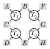

# Homework 8

1. (Einsum notation) Write the einsum notation for the following operations:
    - Matrix multiplication with transpose: $C = A B^T$
    - Summing over all elements in a matrix: $\sum_{i,j} A_{i,j}$
    - Multiplying three matrices element-wise: $D = A \odot B \odot C$
    - Kronecker product: $D = A \otimes B \otimes C$

2. (Contraction order) What is the optimal contraction order for the following tensor network?
   
  
  
  where $T_i$ are tensors, $A - H$ are indices.

4. (Partition function) Compute the partition function $Z$ for the AFM (anti-ferromagnetic) Ising model on the Fullerene graph. Please scan the inverse temperature $\beta$ from $0.1$ to $2.0$ with step $0.1$. For the information needed to construct the Fullerene graph, please refer to Homework 7.
   
  

6. (Challenge) Develop a better algorithm to compute the contraction order. If you can beat all algoirthms in [OMEinsumContractionOrders.jl](https://github.com/TensorBFS/OMEinsumContractionOrders.jl), you will get an A+.
A good starting point is this benchmark repository: [OMEinsumContractionOrdersBenchmark](https://github.com/TensorBFS/OMEinsumContractionOrdersBenchmark)
